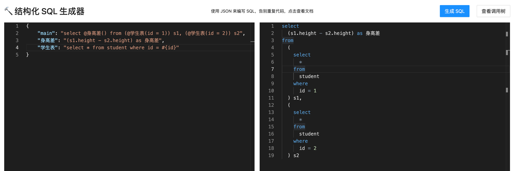
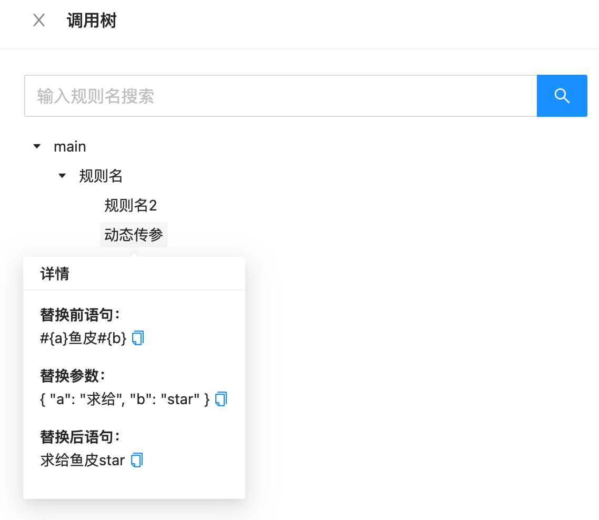
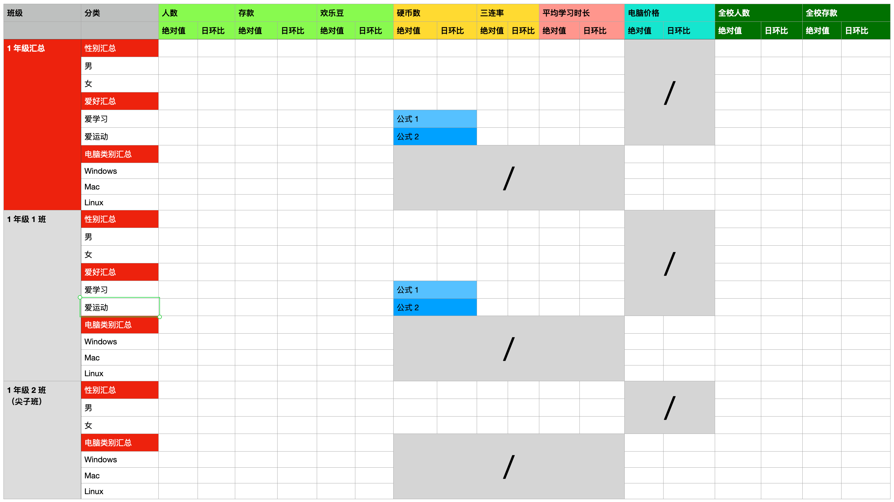
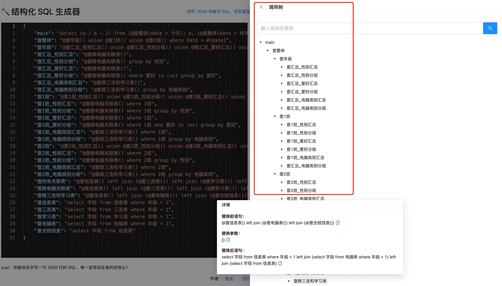

# 结构化 SQL 生成器

> 用 JSON 来轻松生成复杂的 SQL，大幅提高写 SQL 的效率！
> 
> by 程序员鱼皮

在线使用：http://sql.yupi.icu

项目介绍视频：https://www.bilibili.com/video/BV1qa411J7vh/



## 项目作用

1. 将 SQL 的编写逻辑 `结构化` ，像写文章大纲一样编写和阅读 SQL
2. 重复的 SQL 只需编写一次 ，SQL 变动时修改一处即可
3. 可以针对某部分 SQL 进行传参和调试
4. 查看 SQL 语句的引用树和替换过程，便于分析理解 SQL



## 应用场景

如果你要写一句复杂的 SQL，且 SQL 中很多代码是 **相似** 但又不相同的。那么推荐使用该工具，可以不用重复编写 SQL，更有利于修改、维护和理解。

尤其是在大数据分析场景下，经常会有编写复杂 SQL 的需求。 

> 之所以会有这个轮子，也正是因为鱼皮在工作中要写一句长达 3000 行的 SQL 来离线分析数据，手写真的人要疯了！

当然，你也完全可以把它当做一个 `重复代码生成器` ~

## 示例

需求：计算 id = 1 和 id = 2 的两位同学的身高差

SQL 大概是这样的：

```sql
select (s1.height - s2.height) as 身高差
from 
(select * from student where id = 1) s1,
(select * from student where id = 2) s2
```

显然，上述 SQL 中学生表查询了 2 次，而且除了查询的 id 不同外，查询逻辑完全一致！

如果后面查询学生的逻辑发生修改，那么以上 2 个子查询都要同时修改，不利于维护。

而使用本工具，只需编写如下 JSON，就能自动生成完整的 SQL 了：

```json
{
    "main": "select @身高差() from (@学生表(id = 1)) s1, (@学生表(id = 2)) s2",
    "身高差": "(s1.height - s2.height) as 身高差",
    "学生表": "select * from student where id = #{id}"
}
```

通过类似 `函数调用 + 传参` 的方式，我们无需重复编写 SQL，而且整个 SQL 的逻辑更清晰！

当然，以上只是一个示例，真实大数据离线分析的场景下，SQL 可比这复杂 N 倍！

如果感兴趣的话，欢迎往下看文档，还有更复杂的示例~

## 优势

1. 支持在线编辑 JSON 和 SQL，支持代码高亮、语法校验、一键格式化、查找和替换、代码块折叠等，体验良好
2. 支持一键生成 SQL
3. 支持参数透传，比如 @a(xx = #{yy})，yy 变量可传递给 @a 公式
4. 支持嵌套传参（将子查询作为参数），比如 @a(xx = @b(yy = 1))
5. 不限制用户在 JSON 中编写的内容，因此该工具也可以作为重复代码生成器来使用
6. 支持查看 SQL 语句的调用树和替换详情，便于分析引用关系

## 文档

可以把下面的代码放到生成器中试试，一下就明白如何使用啦~

```json
{
  "main": "必填, 代码从这里开始生成, 用 @规则名() 引用其他语句",
  "规则名": "可以编写任意 SQL 语句 @规则名2() @动态传参(a = 求给 ||| b = star)",
  "规则名2": {
    "sql": "用 #{参数名} 指定可被替换的值",
    "params": {
      "参数名": "在 params 中指定静态参数, 会优先被替换"
    }
  },
  "动态传参": "#{a}鱼皮#{b}"
}
```

### 补充说明

`对象键`：定义 SQL 生成规则名称，main 表示入口 SQL，从该 SQL 语句开始生成。

`对象值`：定义具体生成规则。可以是 SQL 字符串或者对象。

`sql`：定义模板 SQL 语句，可以是任意字符串，比如一组字段、一段查询条件、一段计算逻辑、完整 SQL 等。

`params`：静态参数，解析器会优先将该变量替换到当前语句的 #{变量名} 中

`#{xxx}`：定义可被替换的变量，优先用当前层级 params 替换，否则由外层传递

`@xxx(yy = 1 ||| zz = #{变量})`：引用其他 SQL，可传参，参数可再用变量来表示，使用 |||（三个竖线）来分隔参数。

## 复杂示例

需求：用一句 SQL 查询出以下表格



这个表格的难点在哪？

1. 查汇总和查明细的粒度不同，不能用 group by 区分，只能用 union（红色）
2. 分类列中不同行的数据有交叉，不能用 group by 区分，只能用 union
3. 每一列由多张表共同 join 而成，且不同分类可关联的表不同，须进行区分（灰色表示无法关联），并将缺失的字段补齐（否则无法 union）
4. 不同行的同一列计算公式可能不同（蓝色）
5. 不同列的过滤条件不同（比如最后两列墨绿色是要查全校，其余列只查 1 年级）
6. 要查询同环比，只能用 2 份完整的数据去 join 然后错位计算来得出

显然，这个表中很多查询逻辑是重复但又不同的。

这么算下来，最后这个 SQL 中到底会包含多少个基础表的 select 呢？每个基础表查询要重复编写多少遍呢？

然而，这个表格也只是鱼皮对实际需求简化后才得来的，实际需求比这还复杂几倍！

可想而知，人工写有多恶心？！

但是使用本工具，只需编写如下结构化的 JSON：

```json
{
	"main": "select (a / b - 1) from (@查整体(date = 今天)) a, (@查整体(date = 昨天)) b",
	"查整体": "@查年级() union @查1班() union @查2班() where date = #{date}",
	"查年级": "@查汇总_性别汇总() union @查汇总_性别分组() union @查汇总_爱好汇总() union @查汇总_爱好分组() union @查汇总_电脑类别汇总() union @查汇总_电脑类别分组()",
	"查汇总_性别汇总": "@查除电脑关联表()",
	"查汇总_性别分组": "@查除电脑关联表() group by 性别",
	"查汇总_爱好汇总": "@查除电脑关联表()",
	"查汇总_爱好分组": "@查除电脑关联表() where 爱好 in (xx) group by 爱好",
	"查汇总_电脑类别汇总": "@查除三连和学习表()",
	"查汇总_电脑类别分组": "@查除三连和学习表() group by 电脑类别",

	"查1班": "@查1班_性别汇总() union @查1班_性别分组() union @查1班_爱好汇总() union @查1班_爱好分组() union @查1班_电脑类别汇总() union @查汇总_电脑类别分组()",
	"查1班_性别汇总": "@查除电脑关联表() where 1班",
	"查1班_性别分组": "@查除电脑关联表() where 1班 group by 性别",
	"查1班_爱好汇总": "@查除电脑关联表() where 1班",
	"查1班_爱好分组": "@查除电脑关联表() where 1班 and 爱好 in (xx) group by 爱好",
	"查1班_电脑类别汇总": "@查除三连和学习表() where 1班",
	"查1班_电脑类别分组": "@查除三连和学习表() where 1班 group by 电脑类别",

	"查2班": "@查2班_性别汇总() union @查2班_性别分组() union @查2班_电脑类别汇总() union @查2班_电脑类别分组()",
	"查2班_性别汇总": "@查除电脑关联表() where 2班",
	"查2班_性别分组": "@查除电脑关联表() where 2班 group by 性别",
	"查2班_电脑类别汇总": "@查除三连和学习表() where 2班",
	"查2班_电脑类别分组": "@查除三连和学习表() where 2班 group by 电脑类别",

	"查所有关联表": "@查信息表() left join (@查三连表()) left join (@查学习表()) left join (@查电脑表()) left join (@查全校信息())",
	"查除电脑关联表": "@查信息表() left join (@查三连表()) left join (@查学习表()) left join (@查全校信息())",
	"查除三连和学习表": "@查信息表() left join (@查电脑表()) left join (@查全校信息())",
	"查信息表": "select 字段 from 信息表 where 年级 = 1",
	"查三连表": "select 字段 from 三连表 where 年级 = 1",
	"查学习表": "select 字段 from 学习表 where 年级 = 1",
	"查电脑表": "select 字段 from 电脑表 where 年级 = 1",
	"查全校信息": "select 字段 from 信息表"
}
```

就能自动生成 SQL 了，还可以查看调用关系，非常清晰：




## 实现

使用和 JSON 相性最好的 JavaScript 来实现，编写一份逻辑 JS 文件，可同时应用于 browser 和 server 端。

功能比较轻量，因此选择优先在纯 browser 端实现。

前端使用 `Vue3 + Vite + Ant Design Vue` 开发界面，选用 `Monaco Editor` 实现代码编辑、高亮、格式化等功能。

SQL 生成逻辑如下：

1. JSON 字符串转对象
2. 从入口开始，先替换 params 静态参数，得到当前层解析
3. 对 @xxx 语法进行递归解析，递归解析时，优先替换静态参数，再替换外层传来的调用参数
4. 得到最终 SQL

解析器原本采用正则非贪婪替换方式实现，但无法实现嵌套调用，比如 @a(xx = @b())，会被识别为 @a(xx = @b()，匹配到了最近的右括号。 
因此针对括号嵌套的情况对子查询替换算法做了优化，已支持包含括号语句的嵌套调用。

